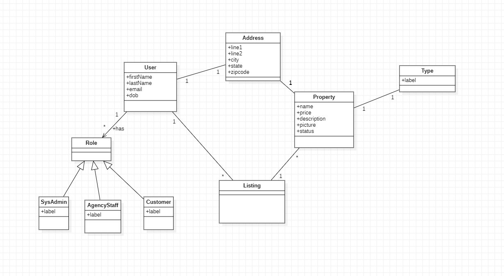
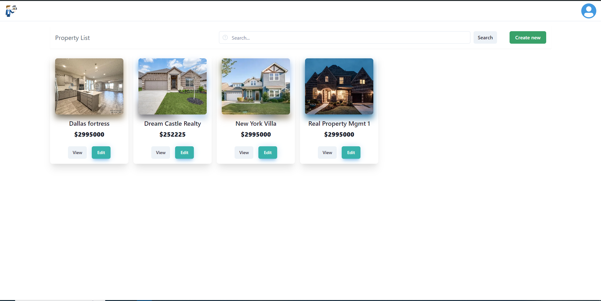
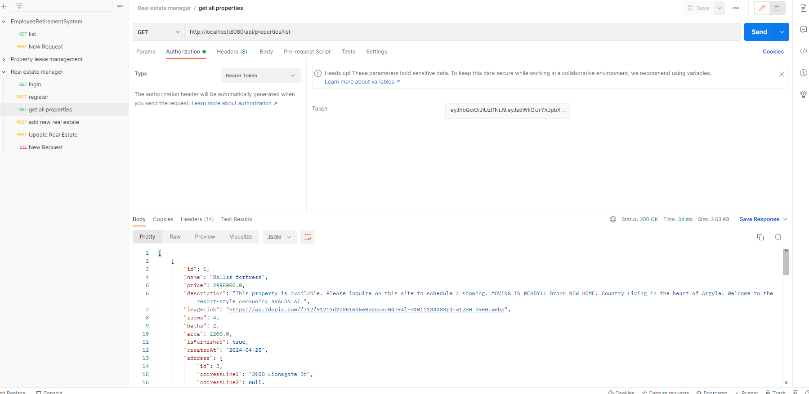
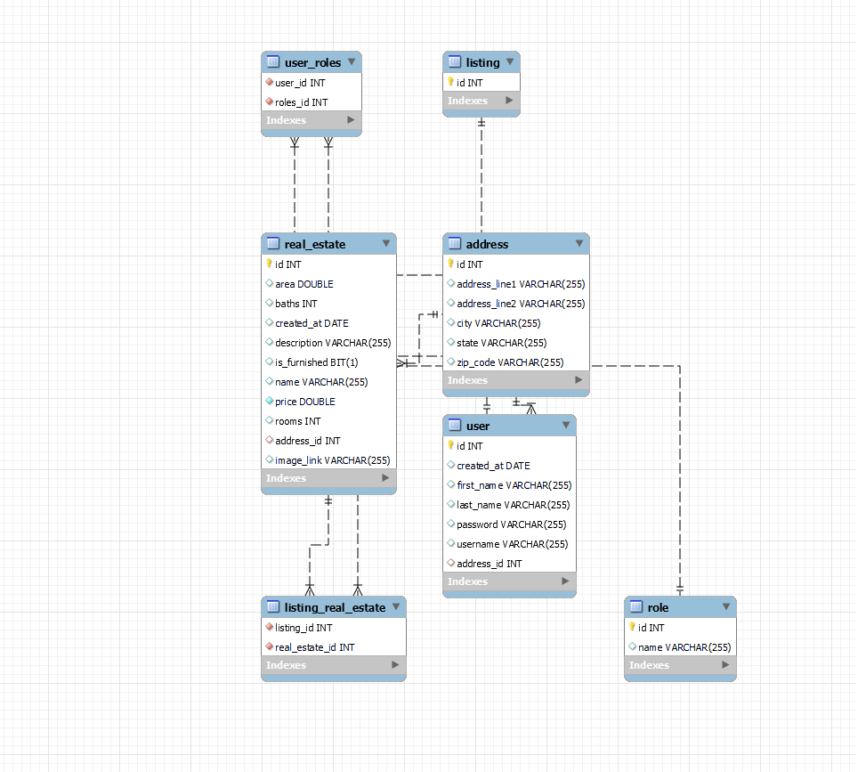

# Realtor: manage your real estate with ease

## Problem statement:

An agency wants a system to manage their real estate portfolios. The system will allow the agency to add, list, remove, update all real
estate with an admin panel. Moreover a web application that will display real estate categories, lists and images of properties.
The system will allow users to create their accounts and save their real estate preferences in their wish lists.
The web application will be accessed throughout different location, mainly Dubai and UAE.

## System alt statements:

1. System will allow authentication of users with different roles including agency staff, system admin and customer
2. System should allow agency staff to add, modify, list real estate properties
3. System will be accessed by guest users and they can list but not do any transaction unless registered as customers
4. System will allow tracking of customer preferences in their listing.

## 1st Iteration:

## 2nd Iteration:

## 3rd Iteration:

### Frontend

### REST API endpoints

### ER Diagram

